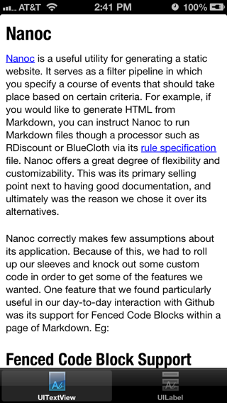
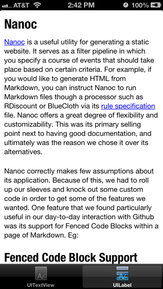

# Profiling

The following profiling data was taken by running the BypassSample on an
iPhone 5 (Model A1428) using the [Time Profiler Trace Template](https://developer.apple.com/library/ios/#documentation/DeveloperTools/Conceptual/InstrumentsUserGuide/AnalysingCPUUsageinYourOSXApp/AnalysingCPUUsageinYourOSXApp.html#//apple_ref/doc/uid/TP40004652-CH16-SW8)
in Intruments

## Result

Note: I have the scaled the following images down by 50%.

As you can see, the results are practically identical. The only difference that
I can see is in the way the underline is rendered. In the `UITextView`, it seems
to be as close to the baseline as possible without being flush with it. The
`UILabel` example has it off a bit more and the added bonus of avoiding the
descenders. Also note that I shifted the `UITextView` down by 3 pts in order to
line up the two examples.

## Condensed View

The following condensed view of the profiling data shows you how much quicker it
is to bypass the HTML rendering system that UIKit uses to draw attributed
strings into a `UITextView`, and instead draw into a `UILabel` using the
typesetting subsystem. All of the following data was used to produce the results
above.

    Running Time	Self		Symbol Name
    46.0ms   23.2%	38.0	 	 -[BPTextViewController viewWillAppear:]
    27.0ms   13.6%	19.0	 	 -[BPLabelViewController viewWillAppear:]

## Expanded View

The expanded view of the data follows.

### UITextView

    Running Time	Self		Symbol Name
    46.0ms   23.2%	0	 	-[BPTextViewController viewWillAppear:]
    36.0ms   18.1%	0	 	 -[UITextView setAttributedText:]
    21.0ms   10.6%	7	 	  -[UITextView setContentToHTMLString:]
    14.0ms    7.0%	13	 	   -[DOMHTMLElement setInnerHTML:]
     1.0ms    0.5%	0	 	    -[WebHTMLView setNeedsDisplayInRect:]
     1.0ms    0.5%	1	 	     -[WAKView setNeedsDisplayInRect:]
    12.0ms    6.0%	0	 	  -[NSHTMLWriter HTMLData]
    12.0ms    6.0%	0	 	   -[NSHTMLWriter _generateHTML]
     6.0ms    3.0%	0	 	    -[NSHTMLWriter _paragraphClassforParagraphStyle:range:isEmpty:isCompletelyEmpty:headerString:alignmentString:directionString:]
     4.0ms    2.0%	4	 	     -[__NSCFString appendFormat:]
     1.0ms    0.5%	1	 	     -[UIFont familyName]
     1.0ms    0.5%	1	 	     -[NSHTMLWriter _defaultValueForAttribute:range:]
     4.0ms    2.0%	2	 	    -[NSHTMLWriter _spanClassForAttributes:inParagraphClass:spanClass:flags:]
     2.0ms    1.0%	2	 	     -[__NSCFString appendFormat:]
     1.0ms    0.5%	0	 	    -[NSHTMLWriter _isStrictByParsingExcludedElements]
     1.0ms    0.5%	1	 	     -[NSString compare:options:range:]
     1.0ms    0.5%	1	 	    -[__NSCFString substringWithRange:]
     1.0ms    0.5%	0	 	  -[NSString stringByReplacingOccurrencesOfString:withString:]
     1.0ms    0.5%	0	 	   -[NSString stringByReplacingOccurrencesOfString:withString:options:range:]
     1.0ms    0.5%	1	 	    -[__NSCFString replaceOccurrencesOfString:withString:options:range:]
     1.0ms    0.5%	1	 	  -[__NSCFString substringWithRange:]
     1.0ms    0.5%	1	 	  -[NSPlaceholderString initWithData:encoding:]
     5.0ms    2.5%	0	 	 -[BPAttributedStringRenderer renderDocument:]
     5.0ms    2.5%	0	 	  -[BPAttributedStringRenderer renderElement:toTarget:]
     4.0ms    2.0%	0	 	   -[BPAttributedStringRenderer renderElement:toTarget:]
     2.0ms    1.0%	0	 	    -[BPAttributedStringRenderer renderElement:toTarget:]
     2.0ms    1.0%	0	 	     -[BPAttributedStringRenderer renderTextElement:toTarget:]
     1.0ms    0.5%	0	 	      -[BPAttributedStringRenderer renderSpanElement:withFont:toTarget:]
     1.0ms    0.5%	0	 	       -[BPAttributedStringRenderer renderSpanElement:withFont:attributes:toTarget:]
     1.0ms    0.5%	0	 	        -[NSConcreteAttributedString dealloc]
     1.0ms    0.5%	0	 	         -[NSRLEArray dealloc]
     1.0ms    0.5%	1	 	          -[NSObject release]
     1.0ms    0.5%	1	 	      -[__NSDictionaryM dealloc]
     2.0ms    1.0%	0	 	    -[BPAttributedStringRenderer renderTextElement:toTarget:]
     2.0ms    1.0%	0	 	     -[BPAttributedStringRenderer renderSpanElement:withFont:toTarget:]
     2.0ms    1.0%	1	 	      -[BPAttributedStringRenderer renderSpanElement:withFont:attributes:toTarget:]
     1.0ms    0.5%	0	 	       -[NSConcreteAttributedString dealloc]
     1.0ms    0.5%	1	 	        -[NSRLEArray dealloc]
     1.0ms    0.5%	0	 	   -[BPAttributedStringRenderer renderHeaderElement:inRange:toTarget:]
     1.0ms    0.5%	0	 	    -[BPElement objectForKeyedSubscript:]
     1.0ms    0.5%	1	 	     -[BPElement attributes]
     3.0ms    1.5%	3	 	 -[BPParser parse:]
     1.0ms    0.5%	1	 	 -[NSBundle pathForResource:ofType:]
     1.0ms    0.5%	0	 	 -[NSHTMLWriter dealloc]
     1.0ms    0.5%	1	 	  -[NSDictionary objectEnumerator]

### UILabel

  	  Running Time	Self		Symbol Name
    27.0ms   13.6%	0	 	-[BPLabelViewController viewWillAppear:]
    18.0ms    9.0%	0	 	 -[NSAttributedString(NSExtendedStringDrawing) boundingRectWithSize:options:context:]
    18.0ms    9.0%	0	 	  -[NSAttributedString(NSExtendedStringDrawing) _doBoundingRectWithSize:options:context:baselineOffset:]
    14.0ms    7.0%	0	 	   -[NSStringDrawingTextStorage usedRectForTextContainer:]
    14.0ms    7.0%	0	 	    -[NSLayoutManager glyphRangeForTextContainer:]
    14.0ms    7.0%	0	 	     -[NSLayoutManager textContainerForGlyphAtIndex:effectiveRange:]
    13.0ms    6.5%	0	 	      -[NSLayoutManager(NSPrivate) _fillLayoutHoleAtIndex:desiredNumberOfLines:]
    13.0ms    6.5%	0	 	       -[NSLayoutManager(NSPrivate) _fillLayoutHoleForCharacterRange:desiredNumberOfLines:isSoft:]
    13.0ms    6.5%	0	 	        -[NSATSTypesetter layoutCharactersInRange:forLayoutManager:maximumNumberOfLineFragments:]
    13.0ms    6.5%	0	 	         -[NSTypesetter layoutCharactersInRange:forLayoutManager:maximumNumberOfLineFragments:]
    13.0ms    6.5%	1	 	          -[NSTypesetter _layoutGlyphsInLayoutManager:startingAtGlyphIndex:maxNumberOfLineFragments:maxCharacterIndex:nextGlyphIndex:nextCharacterIndex:]
    10.0ms    5.0%	0	 	           -[NSATSTypesetter layoutParagraphAtPoint:]
    10.0ms    5.0%	0	 	            -[NSATSTypesetter _layoutLineFragmentStartingWithGlyphAtIndex:characterIndex:atPoint:renderingContext:]
     9.0ms    4.5%	0	 	             -[NSATSLineFragment layoutForStartingGlyphAtIndex:characterIndex:minPosition:maxPosition:lineFragmentRect:]
     7.0ms    3.5%	0	 	              -[NSATSTypesetter _ctTypesetter]
     4.0ms    2.0%	3	 	               -[NSATSGlyphStorage createCTTypesetter]
     1.0ms    0.5%	1	 	                -[_CTMutableGlyphStorage customAdvanceForIndex:]
     3.0ms    1.5%	0	 	               -[NSATSGlyphStorage setGlyphRange:characterRange:]
     3.0ms    1.5%	3	 	                -[UIFont(UIFont_AttributedStringDrawing) getAdvancements:forGlyphs:count:]
     1.0ms    0.5%	0	 	              -[NSATSLineFragment _charIndexToBreakLineByWordWrappingAtIndex:lineFragmentWidth:hyphenate:]
     1.0ms    0.5%	0	 	               -[NSAttributedString(NSAttributedStringKitAdditions) _lineBreakBeforeIndex:withinRange:usesAlternativeBreaker:]
     1.0ms    0.5%	1	 	                -[NSBigMutableString getCharacters:range:]
     1.0ms    0.5%	1	 	              -[NSATSGlyphStorage childGlyphStorageWithCharacterRange:]
     1.0ms    0.5%	1	 	             -[NSATSLineFragment saveMorphedGlyphs:]
     1.0ms    0.5%	0	 	           -[NSLayoutManager isValidGlyphIndex:]
     1.0ms    0.5%	0	 	            -[NSLayoutManager glyphAtIndex:isValidIndex:]
     1.0ms    0.5%	1	 	             -[NSLayoutManager textStorage]
     1.0ms    0.5%	0	 	           -[NSTypesetter setParagraphGlyphRange:separatorGlyphRange:]
     1.0ms    0.5%	0	 	            -[NSTypesetter characterRangeForGlyphRange:actualGlyphRange:]
     1.0ms    0.5%	1	 	             -[NSLayoutManager characterRangeForGlyphRange:actualGlyphRange:]
     1.0ms    0.5%	0	 	      -[NSLayoutManager(NSPrivate) _fillGlyphHoleForCharacterRange:startGlyphIndex:desiredNumberOfCharacters:]
     1.0ms    0.5%	1	 	       -[NSConcreteGlyphGenerator generateGlyphsForGlyphStorage:desiredNumberOfCharacters:glyphIndex:characterIndex:]
     3.0ms    1.5%	0	 	   -[NSStringDrawingTextStorage textContainerForAttributedString:containerSize:lineFragmentPadding:]
     3.0ms    1.5%	0	 	    -[NSConcreteMutableAttributedString replaceCharactersInRange:withAttributedString:]
     3.0ms    1.5%	0	 	     -[NSConcreteNotifyingMutableAttributedString edited:range:changeInLength:]
     3.0ms    1.5%	0	 	      -[NSTextStorage edited:range:changeInLength:]
     3.0ms    1.5%	0	 	       -[NSStringDrawingTextStorage processEditing]
     3.0ms    1.5%	0	 	        -[NSTextStorage invalidateAttributesInRange:]
     3.0ms    1.5%	0	 	         -[NSMutableAttributedString(NSMutableAttributedStringKitAdditions) fixAttributesInRange:]
     2.0ms    1.0%	2	 	          -[NSMutableAttributedString(NSMutableAttributedStringKitAdditions) fixFontAttributeInRange:]
     1.0ms    0.5%	0	 	          -[NSMutableAttributedString(NSMutableAttributedStringKitAdditions) fixParagraphStyleAttributeInRange:]
     1.0ms    0.5%	0	 	           -[NSString(NSStringTextExtras) _endOfParagraphAtIndex:]
     1.0ms    0.5%	0	 	            -[NSString getParagraphStart:end:contentsEnd:forRange:]
     1.0ms    0.5%	0	 	             -[NSString _getBlockStart:end:contentsEnd:forRange:stopAtLineSeparators:]
     1.0ms    0.5%	0	 	              -[NSBigMutableString getCharacters:range:]
     1.0ms    0.5%	1	 	               DYLD-STUB$$-[NSOrderedSet classForCoder]
     1.0ms    0.5%	0	 	   -[NSStringDrawingTextStorage init]
     1.0ms    0.5%	0	 	    -[NSLayoutManager insertTextContainer:atIndex:]
     1.0ms    0.5%	0	 	     -[NSATSTypesetter layoutGlyphsInLayoutManager:startingAtGlyphIndex:maxNumberOfLineFragments:nextGlyphIndex:]
     1.0ms    0.5%	0	 	      -[_NSATSTypesetterGuts initWithTypesetter:]
     1.0ms    0.5%	1	 	       -[NSObject respondsToSelector:]
     6.0ms    3.0%	0	 	 -[BPAttributedStringRenderer renderDocument:]
     5.0ms    2.5%	0	 	  -[BPAttributedStringRenderer renderElement:toTarget:]
     5.0ms    2.5%	0	 	   -[BPAttributedStringRenderer renderElement:toTarget:]
     1.0ms    0.5%	0	 	    -[BPAttributedStringRenderer renderElement:toTarget:]
     1.0ms    0.5%	1	 	     -[NSObject retain]
     1.0ms    0.5%	0	 	    -[BPAttributedStringRenderer renderLinkElement:toTarget:]
     1.0ms    0.5%	0	 	     -[BPAttributedStringRenderer renderSpanElement:withFont:attributes:toTarget:]
     1.0ms    0.5%	1	 	      -[__NSCFString retain]
     1.0ms    0.5%	0	 	    -[BPAttributedStringRenderer renderListItemElement:inRange:toTarget:]
     1.0ms    0.5%	1	 	     -[NSObject release]
     1.0ms    0.5%	0	 	    -[BPAttributedStringRenderer insertBulletIntoTarget:]
     1.0ms    0.5%	1	 	     -[__NSDictionaryI dealloc]
     1.0ms    0.5%	0	 	    -[BPAttributedStringRenderer renderTextElement:toTarget:]
     1.0ms    0.5%	0	 	     -[BPAttributedStringRenderer renderSpanElement:withFont:toTarget:]
     1.0ms    0.5%	0	 	      +[NSDictionary dictionary]
     1.0ms    0.5%	0	 	       -[__NSPlaceholderDictionary initWithObjects:forKeys:count:]
     1.0ms    0.5%	1	 	        +[__NSDictionaryM __new:::::]
     1.0ms    0.5%	0	 	  -[BPDocument elements]
     1.0ms    0.5%	0	 	   -[BPElement initWithElement:]
     1.0ms    0.5%	1	 	    -[BPElement initWithElement:parentElement:]
     2.0ms    1.0%	2	 	 -[BPParser parse:]
     1.0ms    0.5%	1	 	 -[UIScrollView setFrame:]

