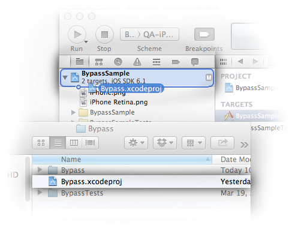
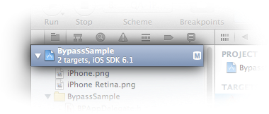
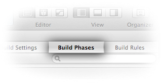
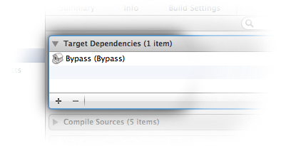
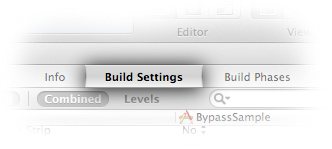

# Bypass iOS

Bypass is a markdown rendering library that can directly render markdown as
stylized text to a `UIView`. The Bypass git repository also contains an Android
project that accomplish the same task. In the git repo, there is also code that
handles markdown parsing and representing that markdown as a tree structure,
similar to the HTML DOM. This code is shared between both platforms.

Bypass is very easy to use. Ultimately, you will end up creating a
`BPMarkdownView`, supplying that view with markdown as an `NSString`, and then
displaying it like you would any other view in your heirarchy. `BPMarkdownView`
descends from `UIScrollView`, so you can supply large bodies of markdown.

It features nicely stylized text for typical usage, tappable links, and a smooth
crossfade between representations for different device orientations.

## Requirements

Bypass requires iOS version 6.0 or greater. You will also need to
[install Boost](http://www.boost.org/doc/libs/1_53_0/more/getting_started/index.html)
if you don't already have it installed.

## Setup

Clone bypass from Github.

    git clone git@github.com:Uncodin/bypass.git

Drag `bypass/platform/ios/Bypass/Bypass.xcodeproj` into your project from the Finder.



Open your target settings.



Select the Build Phases tab.



Add Bypass as a target dependency.



Add `libBypass.a`, `CoreGraphics.framework`, `CoreText.framework`,
`Foundation.framework`, and `QuartzCore.framework`, and `UIKit.framework` to the
list of required libraries to link against, if they aren't already included.


Modify your build settings so they have the following values:

* Linking
  * **Other Linker Flags**: `-ObjC`
* Search Paths
  * **Header Search Paths**: `$(SRCROOT)/<relative path to bypass home>/Bypass/Bypass`
* Apple LLVM Compile 4.2 - Language
  * **C++ Standard Library**: `libc++ (LLVM C++ standard library with C++11 support)`



## Usage

Bypass is very easy to use in terms of displaying markdown. Essentially, you
directly instantiate a `BPMarkdownView` and supply it with markdown to render.
It handles the rest. An example would be:

```objc
// Initialize the markdown view
CGRect markdownRect = CGRectMake(0.f, 0.f, 100.f, 100.f);
BPMarkdownView *markdownView = [[BPMarkdownView alloc] initWithFrame:markdownRect];

// Obtain some markdown
NSString *markdown = @""
	"# Hello, world!"
	""
    "This is my text body. There are many more like it, "
    "but this one is mine.";

// Supply the markdown view with markdown to render
[markdownView setMarkdown:markdown];

// Add the markdown view to a superview
[[self view] addSubview:markdownView];
```

Feel free to directly embed a `BPMarkdownView` in a Nib or Storyboard, but
ensure that you have configured your **Other Linker Flags** to contain `-ObjC`
if you do this. The BypassSample project included in the repo shows an example
of this use case.

## Performance

It's a bit challenging to compare Bypass to, say a `UITextView` representing an
attributed string, because the interesting work happens in different places. 
Essentially, what I deemed most appropriate to compare were a `UIViewController` 
that populates a `UITextView` with an `NSAttributedString`, and 
`BPMarkdownView`'s `layoutSubviews` method. A `UITextView` uses a conversion 
process that leverages HTML to display the text in a stylized manner. A 
`BPMarkdownView` drops down to the Core Text layer and renders the attributed 
string directly.

The results are as follows (I included `drawRect:` for an additional degree
of transparency):

    Running   Time     Self    Symbol Name
    135.0ms   36.3%    94.0    -[BPTextViewController viewWillAppear:]
     39.0ms   10.5%     0.0    -[BPMarkdownView layoutSubviews]
      5.0ms    1.3%     5.0    -[BPMarkdownPageView drawRect:]

I encourage you to profile the BypassSample project yourself. It's interesting
to see everything a `UITextView` is doing, and for what it's doing, it's doing
it very quickly. Bypass is simply faster, though, because it was designed for
this particular purpose from the ground up.

## Conclusion

I hope you enjoy Bypass. Remember that it is a new project, and that there are
probably many enhancements and improvements to be had. Feel free to get involved
and open [issues and enhancements](https://github.com/Uncodin/bypass/issues),
and also feel free to contribute back.
